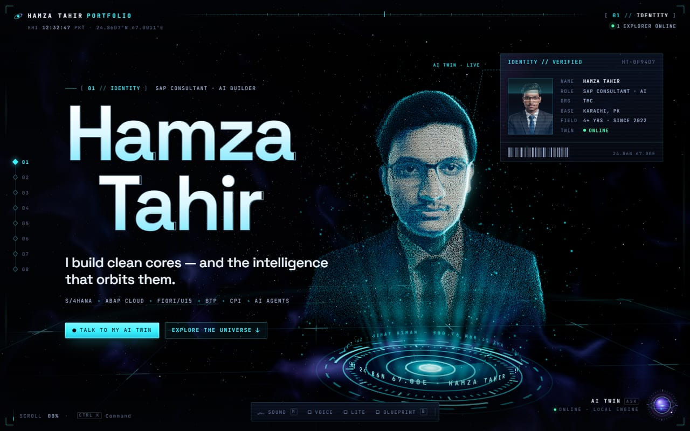
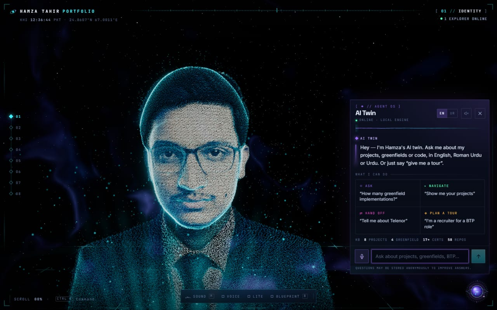
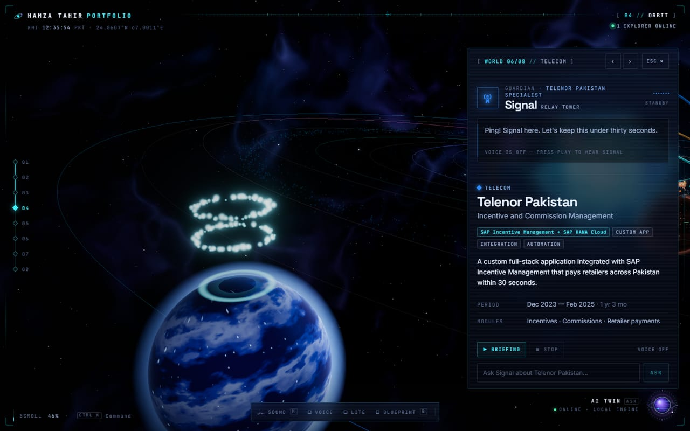
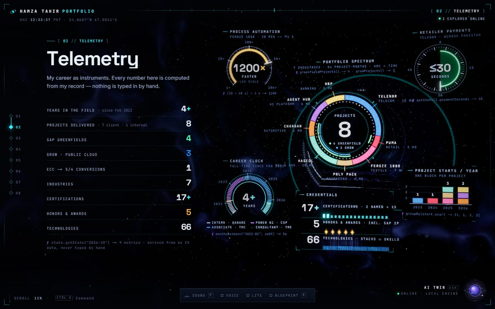
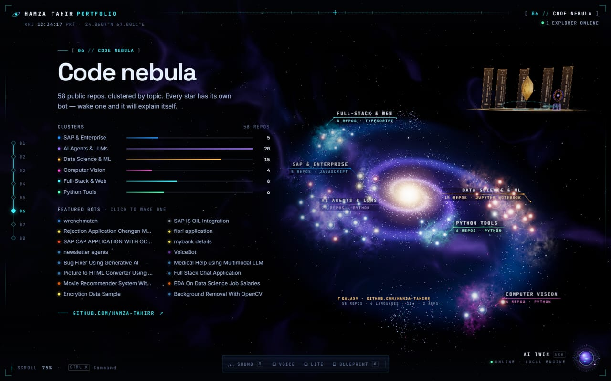
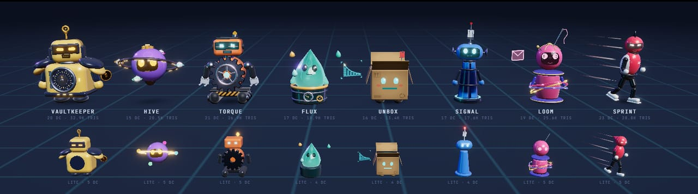

  

  
  
  
  
  

## Hi, I'm Hamza 👋

I'm an SAP Consultant (AI, ABAP, Fiori and BTP) at **TMC (TallyMarks Consulting)** in Karachi. Most of my day goes into S/4HANA: ECC-to-S/4HANA conversions, greenfield implementations on SAP GROW, full-stack ABAP Cloud and Fiori/UI5 apps, and SAP CPI integrations. The rest goes into AI: agents, RAG apps and automation.

One of my solutions, the Hascol S/4HANA Public Cloud build with its IS-OIL integration, is registered as **SAP IP**.

I have a BE in Electrical Engineering (3rd in my department) and taught myself AI and machine learning along the way, so this account has both sides: SAP and AI.

## Hamza Tahir Portfolio 🛰️

I rebuilt my portfolio as a 3D universe you fly through, and the site itself behaves like an AI agent: it notices what you're looking at, offers help, and can take you places.

  

- **An AI twin you can talk to.** A hologram of me, rebuilt from one photo (478 face landmarks, 90k particles). Ask it anything in English, Roman Urdu or Urdu, like "kitni greenfield implementations ki hain?", and it answers out loud.
- **Every project has its own character.** My 8 projects orbit a "Clean Core" on real Kepler orbits. Click one and its guardian flies in and tells you the story in its own voice.
- **Every repo has a bot.** All 58 public repos here live in a 3D code nebula, each with its own procedurally generated robot.
- **Observe, reason, act.** The site shows what it notices and what it does, hands off to the right guardian, and can plan a guided tour for you (try "I'm a recruiter for an SAP BTP role").
- **Real math under the hood.** Kepler's equation for the orbits, golden-angle spheres for the skills, spring dynamics for the motion. Press **B** on the site to see the equations.
- **Stack:** Next.js 16, React 19, React Three Fiber, GSAP, Turso (libSQL) and the Web Speech API.

<table>
  <tr>
    <td width="50%"> <b>AI twin</b>: ask, navigate, hand off, plan a tour</td>
    <td width="50%"> <b>Project worlds</b>: Signal presenting Telenor Pakistan</td>
  </tr>
  <tr>
    <td width="50%"> <b>Telemetry</b>: every number computed from my career data</td>
    <td width="50%"> <b>Code nebula</b>: 58 repos, one bot each</td>
  </tr>
</table>

   
  The guardians: Vaultkeeper, Hive, Torque, Flux, Unbox, Signal, Loom and Sprint

<b>Live: <a href="https://hamza-tahirr-portfolio.vercel.app">hamza-tahirr-portfolio.vercel.app</a></b>

## By the numbers 📡

| | |
|---|---|
| **4+ years** | of professional experience, since February 2022 |
| **8 projects** | 7 for clients and 1 internal AI platform |
| **4 greenfield** | S/4HANA implementations, 3 of them on SAP GROW (Public Cloud) |
| **1 conversion** | ECC to S/4HANA for National Bank of Pakistan |
| **7 industries** | banking, automotive, oil & gas, packaging, telecom, textile and retail |
| **17+ certifications** | including SAP Certified Professional: Solution Architect, SAP BTP |
| **SAP IP** | Hascol S/4HANA Public Cloud solution, including the IS-OIL integration |
| **~1200× faster** | a 20-minute manual task at Feroze 1888 now takes about a second |

## Projects 🪐

| Project | What I built | Stack |
|---|---|---|
| **National Bank of Pakistan** S/4HANA conversion & portal | The ECC to S/4HANA conversion and a three-way CPI integration between a custom portal, the NBP payment gateway and S/4HANA. The portal covers self-service, recruitment, leave, appraisals, salary slips and approvals, with the full SuccessFactors look. | S/4HANA, CPI, React, TypeScript, Node.js, SQL Server |
| **TMC SAP Agent Hub** internal AI platform | The React/Vite interface for TMC's SAP AI agent platform: agent discovery, SAP/MCP connections, FSD-based builds, live runs and analytics for Fiori, ABAP, CDS and Adobe Forms agents. | React, Vite, REST, MCP |
| **Master Changan Motors** SAP GROW | Greenfield S/4HANA Public Cloud for part-by-part vehicle manufacturing: CKD/BOM uploads, packing, storage bins, RFID, product labels and approval workflows in ABAP Cloud and Fiori. | ABAP Cloud, RAP, Fiori/UI5, CDS |
| **Hascol Petroleum** SAP GROW | A clean-core S/4HANA Public Cloud solution across SD, MM and FI with SAP IS-OIL integration. Registered as SAP IP. | S/4HANA Public Cloud, Fiori, CDS, CPI, Groovy |
| **Poly Pack** SAP GROW | Custom Fiori apps for MM, FI, Asset Accounting and Production, plus a Python bot that calculates and posts fixed-asset depreciation. It won the TMC Excellence Award for Innovation. | Fiori, CDS, BTP, Python |
| **Telenor Pakistan** incentives & commissions | A full-stack app on SAP Incentive Management that pays retailers across Pakistan within 30 seconds. | SAP Incentive Management, HANA Cloud, Flask |
| **Feroze 1888 Textile** process automation | Reads purchase orders and invoices from email, validates them and posts them into SAP with no manual work. | SAP Build Process Automation |
| **Puma** S/4HANA greenfield | End-to-end WRICEF across SD, MM and PP: ABAP reports, Adobe Forms and Fiori apps. | S/4HANA, ABAP, Adobe Forms |

## Tech stack 🧠

**SAP** 

**AI / ML** 

**Web & 3D** 

**Data** 

## Some repos worth a look ⭐

| Repo | What it does |
|---|---|
| [wrenchmatch](https://github.com/Hamza-Tahirr/wrenchmatch) | Itemized car repair quotes from approved mechanics near you. Next.js 16, Turso and MapLibre. [Live](https://wrenchmatch.vercel.app) |
| [SAP-IS-OIL-Integration](https://github.com/Hamza-Tahirr/SAP-IS-OIL-Integration) | Third-party systems connected to SAP S/4HANA Cloud Public Edition through SAP Cloud Integration, with CDS views, OData, Groovy and SFTP. |
| [Rejection-Application-Changan-Motors](https://github.com/Hamza-Tahirr/Rejection-Application-Changan-Motors) | A Next.js dashboard for quality rejection documents with approval routing, built on S/4HANA OData. |
| [fiori-application](https://github.com/Hamza-Tahirr/fiori-application) | A freestyle SAPUI5 app on an OData V2 service, tested with QUnit and OPA5. |
| [SAP-CAP-APPLICATION-WITH-ODATA](https://github.com/Hamza-Tahirr/SAP-CAP-APPLICATION-WITH-ODATA) | AngularJS and Node.js/Express app that manages employee records through an SAP Gateway OData service. |
| [newsletter-agents](https://github.com/Hamza-Tahirr/newsletter-agents) | A multi-agent CrewAI pipeline behind a FastAPI endpoint that researches a topic and writes a newsletter. |
| [Azure-OpenAI-Model-based-Tool-Calling-Agent-using-LangGraph](https://github.com/Hamza-Tahirr/Azure-OpenAI-Model-based-Tool-Calling-Agent-using-LangGraph) | A Flask chatbot on Azure OpenAI (through LangChain) with a tool that looks up IP address details from the IPStack API. |
| [Bug-Fixer-Using-Generative-AI](https://github.com/Hamza-Tahirr/Bug-Fixer-Using-Generative-AI) | A Flask app that explains and fixes code errors with Azure OpenAI. It tracks free uses in SQLite and takes payments with Stripe. |
| [Medical-Help-using-Multimodal-LLM](https://github.com/Hamza-Tahirr/Medical-Help-using-Multimodal-LLM) | A Streamlit app that analyses medical images with GPT-4o. |
| [Movie-Recommender-System-With-Streamlit](https://github.com/Hamza-Tahirr/Movie-Recommender-System-With-Streamlit) | A content-based movie recommender on the TMDB 5000 dataset using cosine similarity. |

You can find everything else under [repositories](https://github.com/Hamza-Tahirr?tab=repositories).

## Awards 🏆

- My Hascol S/4HANA Public Cloud solution, including the IS-OIL integration, is registered as **SAP IP**
- **TMC Excellence Award, Innovation** (2026), for the fixed-asset depreciation automation
- **Best Customized Solution**, Telenor Pakistan engagement
- **Most Innovative SAP Solution**, TMC (October 2024)
- **Best Customized Solution**, TMC Annual Dinner

## GitHub activity 📈

  

## Contact 📬

- Email: hamzatahir.tmc@outlook.com
- LinkedIn: [hamza-tahir-49618a1b2](https://www.linkedin.com/in/hamza-tahir-49618a1b2/)
- Kaggle: [hamzatahirrr](https://www.kaggle.com/hamzatahirrr)
- Stack Overflow: [Hamza Tahir](https://stackoverflow.com/users/15592409/hamza-tahir)
